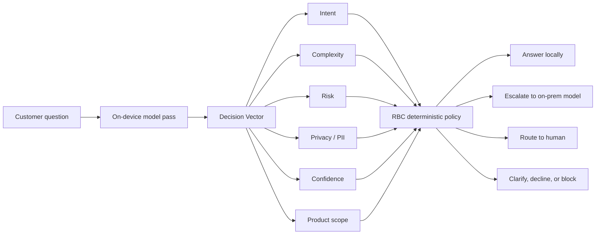
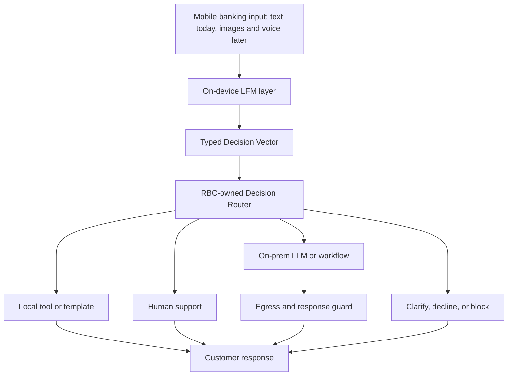

# RBC Executive Technical Deck

## Slide 1: The Decision RBC Is Actually Making

**Slide copy**

- RBC is not choosing a chatbot. RBC is choosing the local control plane for AI-assisted banking.
- The first use case is a question classifier/router: handle locally, escalate to a larger on-prem model, or route to a human.
- The long-term decision is whether RBC builds and maintains its own edge SLM platform, or partners with Liquid for an edge-native model family and applied ML loop.
- Liquid's position: use LFM where latency, privacy, memory, and frequent policy adaptation matter; keep larger on-prem models for synthesis and long-tail reasoning.
- The POC is evidence of a working architecture, not a request to accept a finished product.

**Speaker notes**

Start by agreeing with RBC's framing. A local router is the right wedge. Then elevate it: once the router controls customer experience, risk, privacy, and escalation, it becomes infrastructure. Liquid should be evaluated as an edge intelligence partner, not as a one-off classifier vendor.

**Stress-test question we expect**

"Why would we depend on a model RBC does not own?"

**Prepared answer**

Because the value is not just the weights. RBC keeps ownership of policy, taxonomy, evals, thresholds, escalation rules, and customer data. Liquid brings an edge-specialized foundation-model family, the training and deployment stack, and the team that can adapt the model in lockstep with RBC's ML team. If the benchmark proves a generic open-source model is better for the full system, RBC should use it.

## Slide 2: RBC's Router Hypothesis Is Right, But The Router Will Not Stay One Label

**Slide copy**

- RBC's proposed router categories are the correct first benchmark: local on-device, larger on-prem model, or human agent.
- In banking, the route is rarely decided by intent alone.
- A real route also depends on privacy, risk, ambiguity, product scope, confidence, vulnerable-customer handling, and audit requirements.
- Compressing those axes into one label creates either an opaque route decision or an exploding taxonomy.
- Liquid's proposal is a Decision Layer: separate typed signals, composed by deterministic RBC policy.

**Speaker notes**

The picture should make RBC comfortable. The model is not making final banking decisions in a free-form way. The model emits typed signals. RBC policy decides what happens next. That is the governance story.

**Stress-test question we expect**

"Is this just making a simple router more complicated?"

**Prepared answer**

It makes the existing complexity explicit. A bank already has multiple route criteria. The Decision Layer lets RBC inspect and test each axis separately instead of hiding them in one route label.

## Slide 3: Why Liquid, In Business Terms

**Slide copy**

- **Lower operating cost:** run the common-path decision locally before cloud or on-prem inference is invoked.
- **Lower maintenance burden:** avoid building the full edge-model lifecycle platform from scratch across iOS, Android, data, evals, fine-tuning, packaging, and deployment.
- **Better client experience:** local routing removes network variability from the first decision and keeps the app responsive under normal banking-session patterns.
- **Better privacy posture:** sensitive text can be classified locally before any escalation decision is made.
- **More capability per mobile budget:** one base model can support many local decisions; new bounded heads are small compared with shipping separate models.
- **Faster learning cycle:** Liquid can co-develop taxonomy, data, evals, and retraining with RBC's ML team rather than handing over a generic model checkpoint.

**Speaker notes**

Do not invent percentage savings. Say we will calculate ROI with RBC using their query volume, escalation rates, cloud/on-prem inference cost, app-release cost, and engineering staffing model. Then anchor the discussion in measured POC deltas: local latency, smaller footprint, and many heads from one pass.

**Stress-test question we expect**

"What cost savings can you guarantee?"

**Prepared answer**

We should not guarantee a percentage before RBC provides traffic, current routing, escalation, and serving-cost data. The measurable levers are clear: fewer cloud/on-prem calls on common-path queries, fewer human escalations caused by poor routing, smaller app-side model footprint, faster policy iteration, and less internal platform maintenance. The next phase should quantify those with RBC's numbers.

## Slide 4: The Hidden Cost Of Building This Entirely In-House

**Slide copy**

- RBC can build iOS and Android AI model engineering teams; the question is what they should own long term.
- The first router is the easy part. The durable cost is the model lifecycle: data, evals, fine-tuning, quantization, packaging, device testing, SDK integration, model updates, regressions, and support.
- Every new banking experience repeats that lifecycle unless there is a reusable platform.
- Open-source weights reduce starting cost, but RBC still owns runtime integration, device performance, adapter compatibility, eval gates, and release operations.
- Liquid's value is to make RBC's model team more leveraged: RBC owns policy and product intelligence; Liquid owns much of the edge-model plumbing and model adaptation loop.
- That partnership should reduce time-to-new-experience and the number of internal specialists needed to maintain edge AI safely.

**Speaker notes**

This is the build-versus-partner slide. Do not frame Liquid as replacing RBC's ML team. The better argument is leverage: RBC should own the banking brain, governance, and acceptance criteria. Liquid should help carry the specialized edge-model engineering burden that is expensive to recreate.

**Stress-test question we expect**

"If we hire the model engineers, why do we need Liquid?"

**Prepared answer**

Because hiring the team does not eliminate the lifecycle. RBC would still need to maintain model selection, fine-tuning, regression evals, mobile runtime integration, model packaging, device benchmarking, and future multimodal extensions. Liquid gives that team a specialized platform and direct engineering path so they can focus on RBC-specific policy, data, and experiences instead of rebuilding edge infrastructure.

## Slide 5: LEAP And Workbench Are The Platform Argument

**Slide copy**

- LEAP is Liquid's full-stack on-device AI platform: model selection, model customization, bundling, SDK integration, and local inference in one toolchain.
- LEAP Edge SDK gives mobile developers a native path to load and query models locally, with iOS and Android documentation and model-downloading support.
- The iOS SDK is Swift-first and supports Swift Package Manager, CocoaPods, manual XCFramework installation, GGUF manifests, streaming, images/audio, constrained generation, and function calling.
- The Android SDK path includes model loading and downloading, with Android-specific downloader support for background downloads, notifications, WorkManager, and network interruption handling.
- LEAP Workbench helps teams compare models side by side, run AI-judge evaluations, generate synthetic data, receive optimization suggestions, and download deployment snippets for iOS, Android, and Python.
- Fine-tuning docs support common workflows such as TRL, LoRA, and Unsloth, so the platform does not force RBC into a one-off internal training stack.

**Speaker notes**

This is not "trust our model." It is "avoid owning every layer of edge AI tooling yourself." The platform story matters because RBC's use case is still evolving. The cheaper long-term path is a repeatable loop: define task, build evals, compare models, tune, package, deploy, monitor, and revise.

**Stress-test question we expect**

"Is LEAP mature enough for a regulated bank?"

**Prepared answer**

LEAP and Workbench are platform accelerators, not a substitute for RBC security review, procurement, compliance terms, or production controls. For this pre-sales phase, their value is speed and repeatability: they reduce the engineering surface RBC has to build just to run fair model comparisons and edge deployments.

**Sources**

Public: [LEAP platform](https://leap.liquid.ai/platform), [iOS SDK quick start](https://docs.liquid.ai/deployment/on-device/ios/ios-quick-start-guide), [Android model loading](https://docs.liquid.ai/deployment/on-device/android/model-loading), [LEAP Workbench](https://workbench.liquid.ai/), [Liquid customization docs](https://docs.liquid.ai/customization/getting-started/welcome), [TRL fine-tuning docs](https://docs.liquid.ai/customization/finetuning-frameworks/trl).

## Slide 6: The Architecture We Want RBC To Evaluate

**Slide copy**

- Treat LFM as the local perception and control layer, not the only model in the system.
- The on-device layer produces typed routing, safety, privacy, and context signals.
- The deterministic router decides whether to answer locally, use a tool, clarify, escalate to on-prem, or involve a human.
- Larger models remain valuable for synthesis, complex reasoning, and long-tail requests.
- This separation makes governance cleaner: local heads produce evidence; RBC policy makes the decision; downstream systems execute.

**Speaker notes**

This is the executive architecture. RBC does not need to buy the claim that a small model replaces everything. The small local model handles frequent, bounded, latency-sensitive decisions. Bigger systems are invoked when needed.

**Stress-test question we expect**

"Are you saying the on-device model should answer banking questions by itself?"

**Prepared answer**

No. Some responses can be local, such as templates or device-side tools, but the primary value is route control. The local layer decides what should happen next and what privacy/risk constraints apply before escalation.

## Slide 7: Why LFM Is A Fit For The Edge Control Plane

**Slide copy**

- The router runs before the customer sees value, so latency and memory are product requirements, not ML niceties.
- LFM2.5-350M uses a hybrid architecture with 10 LIV convolution blocks and 6 grouped-query attention blocks.
- That design is aimed at the mobile physics of inference: less memory pressure, fewer attention-heavy layers, and efficient local token processing.
- Liquid public material reports LFM2.5-350M was trained on 28T tokens and optimized for tool use, data extraction, and structured outputs at 350M parameters.
- In the RBC iPhone benchmark, LFM2.5-350M measured 209 MB file size, 519 ms load time, 293 MB peak inference memory, and 103.5 tok/s decode.
- Those numbers matter because every extra local decision must fit inside the customer's real phone, not just a lab benchmark.

**Speaker notes**

This is where the LFM story becomes specific. Do not say "open source cannot do this." Say: open-source models are valid baselines, but LFM is designed for the constraints that decide whether a local banking control plane is usable at scale.

**Stress-test question we expect**

"Qwen and Gemma are also small. What is unique?"

**Prepared answer**

Small parameter count is not enough. The useful comparison is full-system edge cost: load time, peak memory, sustained throughput, classifier-head scaling, battery/thermal behavior, and quality after task adaptation. That is why we propose a staged benchmark, not a one-number model comparison.

**Sources**

Public: [LFM2.5-350M release](https://www.liquid.ai/blog/lfm2-5-350m-no-size-left-behind). POC metrics: Liquid RBC iOS benchmark brief, May 2026.

## Slide 8: What The RBC POC Proved

**Slide copy**

- Liquid built a working iOS POC for an on-device banking intelligence layer.
- The POC used one shared classification adapter for 14 sequence-level heads, plus a separate token-level PII path.
- The 14 sequence heads achieved 95.7% mean primary metric on their POC eval sets.
- Multi-head routing ran in roughly 40-52 ms because the backbone pass is shared and the heads are small projections.
- The classification adapter footprint moved from roughly 320 MB with per-head adapters to roughly 23 MB with one shared adapter.
- This proves architectural feasibility; it does not prove RBC production readiness, final compliance posture, or final RBC taxonomy.

**Speaker notes**

Say this plainly: "We built the shape of the thing. Now we need to map it to your taxonomy, data, policy, and devices." This keeps the credibility high.

**Stress-test question we expect**

"Are these production numbers?"

**Prepared answer**

No. They are POC measurements. They are strong enough to justify the next phase, not strong enough to skip RBC-owned validation.

**Sources**

Liquid RBC iOS POC: shared multi-head architecture record and classifier-head bundle inventory, April-May 2026.

## Slide 9: The Strategic Expansion Is Text, Vision, Voice

**Slide copy**

- The router is the first control-plane use case; it should not be the last.
- Banking workflows naturally become multimodal: document capture, check images, receipts, screenshots, card images, branch/ATM context, and voice support.
- Liquid's model family already includes text, vision-language, audio-language, and task-specialized Nano models.
- LFM2.5-VL pairs a SigLIP2 vision encoder with an LFM text decoder for structured visual outputs such as OCR/extraction, classification, grounding, bounding boxes, captions, and JSON.
- LFM2.5-Audio is a native audio-language model, avoiding the classic ASR -> LLM -> TTS cascade for voice interactions.
- Any Omni-style roadmap should be positioned as directionally important but not part of the RBC POC claim: one governed edge layer across text, image, and voice signals.
- The executive argument: start with text routing, but choose a model partner whose architecture can extend to the next customer interfaces.

**Speaker notes**

This is the missing strategic wedge. The story is not "classifier heads are unique." The story is that Liquid is a fit-for-edge model company across modalities. RBC can start with the safest, easiest control-plane use case and preserve a path to visual and voice intelligence later.

**Stress-test question we expect**

"Did the RBC POC validate vision, audio, or Omni?"

**Prepared answer**

No. The RBC POC validated the text Decision Layer pattern. Vision and audio are adjacent Liquid capabilities that matter to roadmap fit. Omni should be discussed only as an approved roadmap direction, not as a delivered RBC capability.

**Sources**

Public: [Liquid vision models docs](https://docs.liquid.ai/lfm/models/vision-models), [LFM2.5-VL-450M release](https://www.liquid.ai/blog/lfm2-5-vl-450m), [Liquid audio models docs](https://docs.liquid.ai/lfm/models/audio-models), [LFM2.5 launch/audio section](https://www.liquid.ai/blog/introducing-lfm2-5-the-next-generation-of-on-device-ai).

## Slide 10: How To Compare Liquid Against Open Source Fairly

**Slide copy**

- Do not decide the architecture with a single clean intent-classification benchmark.
- **Stage A: base physics.** No fine-tune. Measure file size, quantized size, load time, peak memory, TPS, embedding latency, and thermal behavior.
- **Stage B: one route head.** Train one comparable classifier head on the same taxonomy, split, and eval set.
- **Stage C: Decision Layer curve.** Train 4, 8, and 14 heads to see whether the stack still fits the device envelope.
- Compare route-policy correctness, not only per-head accuracy.
- Include Qwen, Gemma, AFM where technically feasible, and LFM under the same app harness.

**Speaker notes**

This slide disarms the procurement objection. We are not avoiding open source. We are proposing the apples-to-apples test that matches RBC's real architecture question.

**Stress-test question we expect**

"Can we train Qwen or Gemma with the same pipeline?"

**Prepared answer**

Yes, with engineering work. The LFM heads cannot be reused because the hidden-state geometry is model-specific. A fair benchmark requires training Qwen/Gemma-specific adapters and heads, exporting them into the same app harness, and measuring the same quality, memory, and latency envelope.

## Slide 11: What RBC Buys In The Next Phase

**Slide copy**

- A two-day Decision Layer workshop with RBC ML, mobile, security, product, and operations owners.
- A head taxonomy grounded in RBC's actual routing and escalation policy, not Liquid's demo taxonomy.
- A benchmark plan that compares LFM, Qwen, Gemma, and AFM across base physics, one-head quality, and multi-head scaling.
- A security and privacy review of what runs locally, what escalates, and what logs are produced.
- A platform operating model: what RBC owns, what Liquid owns, how LEAP/Workbench fit, and how model updates are governed.
- A quantified ROI model using RBC-provided volumes, cost per escalation, serving cost, release cadence, model-engineering staffing, and target containment rate.
- A go/no-go recommendation for whether Liquid should become part of RBC's on-device intelligence architecture.

**Speaker notes**

Be crisp: we are not asking for a platform commitment tomorrow. We are asking for the right next phase: align taxonomy, define evals, benchmark alternatives, and put business numbers around the architecture.

**Stress-test question we expect**

"What is the concrete deliverable after the workshop?"

**Prepared answer**

A benchmark spec, a head map, acceptance gates, a device test matrix, an ROI worksheet, a build-versus-partner operating model, and an implementation plan for the next POC iteration.

## Slide 12: The Close

**Slide copy**

- If RBC needs one static classifier forever, the lowest-cost model that wins the benchmark may be enough.
- If RBC is building a governed banking intelligence layer, the architecture matters more than the first head.
- Liquid's bet is that edge-native models plus a Decision Layer create better economics as the system grows.
- The first head is comparable. The seventh head is where shared representation, local latency, and policy composition start to compound.
- The next step is to prove or disprove that curve with RBC's data, devices, policies, and alternatives.

**Speaker notes**

This is the closing line. It is honest and defensible. We are not saying open-source cannot win. We are saying the right unit of comparison is not "one classifier"; it is the scaling curve of the local control plane.

**Stress-test question we expect**

"What happens if Qwen or Gemma wins?"

**Prepared answer**

Then RBC should use it for that workload. Liquid's confidence is in the full edge system: latency, memory, customization, multi-head scaling, and multimodal roadmap. The benchmark should be designed to reveal the truth, not protect a vendor narrative.

# Appendix

## Appendix A: iPhone 14 Pro Base-Model Physics

**Slide copy**

| Metric | LFM2.5-350M | Qwen3-0.6B | Gemma3-270M | Why it matters |
| --- | ---: | ---: | ---: | --- |
| Model file size | 209 MB | 462 MB | 241 MB | App payload and storage budget |
| Model load time | 519 ms | 3,223 ms | 656 ms | Cold start and model eviction recovery |
| Peak memory during load | 82 MB | 373 MB | 232 MB | Coexistence with the banking app and other apps |
| Peak inference memory | 293 MB | 448 MB | 458 MB | Runtime stability under mobile memory pressure |
| Decode throughput | 103.5 tok/s | 55.9 tok/s | 57.0 tok/s | Local responsiveness |
| Sustained throttled speed | 90.6 tok/s | 40.9 tok/s | 50.0 tok/s | Behavior under repeated use |

**Speaker notes**

This is the physics table. It does not prove classifier quality. It proves why LFM is a strong candidate for the edge envelope before we even fine-tune alternatives.

**Source**

Liquid RBC iOS benchmark brief, iPhone 14 Pro, llama.cpp + Metal, May 2026.

## Appendix B: Decision Layer POC Metrics

**Slide copy**

| POC metric | Result | Interpretation |
| --- | ---: | --- |
| Sequence-level heads | 14 | Multiple banking decisions from one shared path |
| Token-level PII path | 1 | Separate path because token tagging needs per-token features |
| Mean primary metric across 14 heads | 95.7% | POC eval result, not a production acceptance claim |
| Multi-head latency | ~40-52 ms | One shared forward pass plus small head projections |
| Classification adapter footprint | ~23 MB | One shared adapter |
| Previous per-head adapter footprint | ~320 MB | Fourteen separate adapters |
| Head storage | ~420 KB total for 15 heads | Bounded decisions are very small once the backbone is present |

**Speaker notes**

Use this appendix when the ML/mobile team asks for the exact POC proof. In the main deck, keep the narrative on value and architecture.

**Source**

Liquid RBC iOS POC classifier-head inventory and shared multi-head architecture record, April-May 2026.

## Appendix C: Third-Party ZETIC Throughput Signal

**Slide copy**

| Device | LFM2.5-350M Auto TPS | Qwen3-0.6B Auto TPS | Gemma 270M Auto TPS | Signal |
| --- | ---: | ---: | ---: | --- |
| iPhone 16 Pro | 177.96 | 65.06 | 123.89 | LFM shows more local throughput headroom |
| iPhone 16 | 176.97 | 48.65 | Not shown | LFM shows more local throughput headroom |
| Galaxy S25 Ultra | 144.99 | Not shown | 101.21 | LFM shows more local throughput headroom |

| Device | LFM Accuracy-mode TPS | Qwen Accuracy-mode TPS | Gemma Accuracy-mode TPS | Signal |
| --- | ---: | ---: | ---: | --- |
| iPhone 16 Pro | 69.72 | 18.58 | 39.20 | Conservative runtime mode still favors LFM throughput |
| iPhone 16 | 73.04 | 18.78 | Not shown | Conservative runtime mode still favors LFM throughput |
| Galaxy S25 Ultra | 76.05 | Not shown | 47.50 | Conservative runtime mode still favors LFM throughput |

**Speaker notes**

Be careful with this slide. ZETIC TPS is third-party device throughput, not RBC task accuracy. Use it as corroborating evidence that LFM has edge-performance headroom.

**Source**

ZETIC screenshots shared by Liquid team; mode semantics from ZETIC documentation for Auto, Speed, and Accuracy runtime modes.

## Appendix D: Public Liquid Multimodal Signals

**Slide copy**

| Area | Public Liquid signal | Relevance to RBC |
| --- | --- | --- |
| Text | LFM2.5-350M targets tool use, data extraction, and structured outputs at 350M parameters | Local router and structured control-plane decisions |
| Vision | LFM2.5-VL-450M adds grounding, instruction following, function calling, and structured outputs | Document capture, check images, dispute evidence, receipts, visual forms |
| Audio | LFM2.5-Audio-1.5B is a native audio-language model for speech/text input and output | Voice banking and support flows without a brittle ASR -> LLM -> TTS cascade |
| Edge deployment | Liquid docs list GGUF, MLX, ONNX, llama.cpp, and LEAP paths across device classes | Helps RBC avoid a one-platform-only architecture |

**Speaker notes**

This is the roadmap-fit slide. It should not claim RBC is buying vision/audio now. It should show why the model partner choice matters if the mobile banking assistant becomes multimodal.

**Sources**

Public Liquid model pages and docs: LFM2.5-350M, LFM2.5-VL, LFM2.5-Audio, and Liquid model library.

## Appendix E: ROI Model To Build With RBC

**Slide copy**

| ROI lever | RBC input needed | How Liquid can affect it |
| --- | --- | --- |
| Cloud/on-prem inference avoided | Query volume, average tokens, cost per model call | Local route and local common-path handling before escalation |
| Human escalation avoided | Escalation volume, cost per handled contact, misroute rate | More precise intent, risk, and confidence routing |
| Mobile experience | Abandonment, task completion, latency tolerance, app ratings | First decision runs locally with stable latency |
| Security/privacy exposure | Data categories, egress rules, consent flows | Local privacy/risk checks before escalation |
| Edge model platform cost | iOS AI engineers, Android AI engineers, model engineers, MLOps, QA, security review cycles | LEAP SDKs, model bundling, model downloading, Workbench evals, and Liquid engineering support |
| Maintenance cost | Internal SLM FTE, release cadence, retraining frequency | Vendor-supported model adaptation, evals, and deployment path |
| Time to new experience | New feature roadmap, data availability, label churn, approval process | Repeatable task -> eval -> tune -> package -> deploy loop |
| Device coverage | Target iOS/Android versions, device mix, memory budgets, offline requirements | Edge SDK path plus device-level benchmarking discipline |
| Capability expansion | Planned text, document, image, and voice workflows | One edge-model partner across text, vision, and audio |

**Speaker notes**

This is the business worksheet. The right thing to say is: "We can give you the variables and the measured deltas; RBC's economics determine the dollar value." That is more credible than inventing benchmark-based savings.

**Stress-test question we expect**

"Can you provide real ROI numbers?"

**Prepared answer**

We can provide measured technical deltas and build a quantified model with RBC. To turn that into dollars, we need RBC's traffic, escalation cost, current containment rate, cloud/on-prem serving cost, mobile release cost, and target channels.

## Appendix F: Build-Versus-Partner Ownership Matrix

**Slide copy**

| Lifecycle layer | If RBC builds alone | With Liquid partnership |
| --- | --- | --- |
| Model selection | RBC tracks open-source releases, benchmarks, regressions, and license terms | Liquid proposes candidate LFMs and baselines; RBC validates with its benchmark |
| Data and taxonomy | RBC owns labels, policy definitions, acceptance gates | Same; Liquid helps translate them into train/eval artifacts |
| Fine-tuning | RBC owns scripts, GPU infra, LoRA targets, regressions, export path | Liquid brings LFM recipes, Workbench, TRL/LoRA guidance, and applied ML support |
| Mobile runtime | RBC builds and maintains iOS/Android inference wrappers | LEAP SDKs provide a native integration path and model loading/downloading patterns |
| Model packaging | RBC owns quantization, manifests, bundle layout, updates | LEAP model bundling and Liquid guidance reduce packaging work |
| Device QA | RBC builds device matrix, thermal tests, memory tests, failure handling | RBC still validates; Liquid contributes benchmark harnesses and edge-model expertise |
| New experiences | Each feature restarts model selection, fine-tuning, and mobile integration | Repeatable path: new head/adapter/eval, same edge platform pattern |
| Multimodal roadmap | Separate teams for text, vision, audio, and runtime integration | One model partner across text, vision, audio, and future approved Omni direction |

**Speaker notes**

This is the slide to use when RBC says, "We can build an internal team." The answer is yes, and they probably should. The better question is whether that team should spend its time rebuilding edge AI infrastructure or owning RBC's product policy, data, governance, and customer experience.

**Stress-test question we expect**

"Does this create vendor lock-in?"

**Prepared answer**

There is always some vendor dependency when choosing a model family and SDK. The mitigation is to keep RBC-owned assets portable where possible: taxonomy, evals, thresholds, policy router, device benchmark harness, and acceptance gates. The staged benchmark should also keep Qwen, Gemma, and AFM in the comparison so RBC is choosing Liquid because the system earns it.

## Appendix G: Claims We Should Avoid

**Slide copy**

- Do not claim a delivered GA product.
- Do not claim signed SOC 2 attestation, DPA, cyber-insurance backing, named compliance officers, or quarterly attestation reports.
- Do not claim open-source models cannot build classifier heads.
- Do not claim the RBC POC proves production readiness.
- Do not claim vision/audio/omni were validated in the RBC POC.
- Do not claim LEAP or Workbench is already approved for RBC's regulated production environment.
- Do not claim guaranteed ROI percentages before RBC provides operating data.

**Speaker notes**

This slide is for internal prep. If it remains in an external version, label it as implementation assumptions or remove it. The safest selling posture is specific, measured, and honest.
