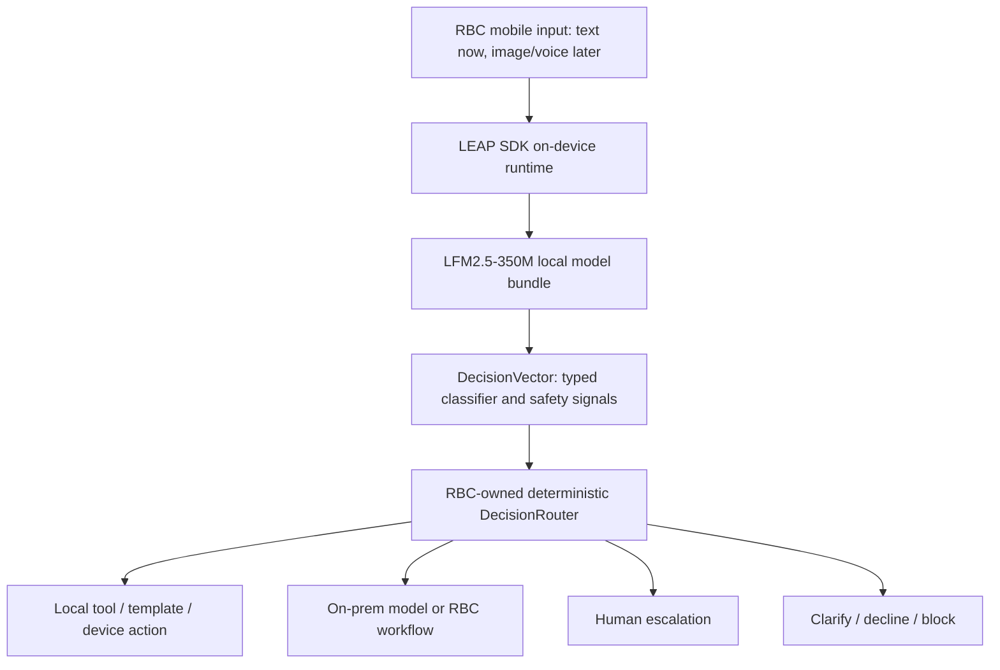

# LFM2.5-350M On-Device Technical Brief

### Prepared for RBC Technical Review — May 2026

---

## Executive Summary

LFM2.5-350M is a 350M-parameter hybrid model (conv/SSM + attention) purpose-built for on-device banking intelligence. Benchmarked head-to-head against Qwen3-0.6B and Gemma3-270M on iPhone 14 Pro:

|                             | LFM2.5-350M     | Qwen3-0.6B            | Gemma3-270M        |
| --------------------------- | --------------- | --------------------- | ------------------ |
| Decode speed                | **103.5 tok/s** | 55.9 tok/s            | 57.0 tok/s         |
| Model load time             | **519ms**       | 3,223ms (6.2x slower) | 656ms              |
| Peak memory (load)          | **82 MB**       | 373 MB (4.5x more)    | 232 MB (2.8x more) |
| Peak memory (inference)     | **293 MB**      | 448 MB                | 458 MB             |
| Model file size             | **209 MB**      | 462 MB                | 241 MB             |
| Energy per query            | **~1.5 Ws**     | ~4.5 Ws (3x more)     | ~3.0 Ws (2x more)  |
| Sustained speed (throttled) | **90.6 tok/s**  | 40.9 tok/s            | 50.0 tok/s         |

**Privacy:** Fully on-device. Zero data transmitted during or after inference. No telemetry, no analytics, no cloud dependency.

**Classifier head architecture:** 15 trained heads (420 KB total) run 14 simultaneous banking classifications in **~40ms** from a single backbone forward pass — replacing ~2.8 seconds of sequential generative inference. Intent routing, PII detection, fraud scoring, dispute triage, transaction enrichment, and compliance checking all execute in under 100ms.

**Production readiness:** 10 of 11 fine-tuned models pass accuracy gates (84.5%–100%). All 8 classifier heads exceed their accuracy gates (89.2%–99.5%). Real banking session (5-8 queries) uses ~5 seconds of GPU time and ~12 Watt-seconds of energy — thermally invisible, equivalent to 8 seconds of Google Maps.

**Deployment:** Base model bundled in IPA. LoRA adapters (1-3 MB) and classifier heads (20-80 KB) updatable via CDN without App Store review. Cold start to first inference: ~890ms. Android deployment is an integration project (same GGUF weights, Kotlin/JNI wrapper) — estimated 4-6 weeks to parity.

---

## 1. Proven On-Device Tasks

| Task                        | Status     | Latency (iPhone 14 Pro)                        |
| --------------------------- | ---------- | ---------------------------------------------- |
| Intent classification       | Production | 6.7ms prefill + head projection                |
| PII detection (token-level) | Production | 84ms embedding + <1ms per-token classification |
| Transaction enrichment      | Production | <50ms end-to-end                               |
| Fraud extraction            | Production | <50ms end-to-end                               |
| Tool use (function calling) | Production | ~700ms (64-token generation)                   |
| Offline chat                | Supported  | Fully offline, no network required             |
| Summarization               | Supported  | ~700ms for 64-token output                     |

All tasks run fully on-device via Metal GPU acceleration. No network dependency. Performance is identical offline and online — the model and all weights are local.

---

## 2. Prompt Length & Context Sensitivity

Benchmarked on iPhone 14 Pro (A16 Bionic), iOS 26.4:

| Prompt tokens      | Prefill latency          | Decode throughput |
| ------------------ | ------------------------ | ----------------- |
| 16 (warmup)        | ~1ms                     | 103 tok/s         |
| 128 (standard)     | 6.7ms                    | 103.5 tok/s       |
| 512 (long context) | ~25ms (estimated linear) | 103 tok/s         |

Prefill scales linearly with prompt length. Decode throughput is constant regardless of prompt size — the autoregressive loop processes one token at a time. Offline performance is identical to online (inference is entirely local).

---

## 3. KV Cache Growth & Total Memory

### Architecture

LFM2.5 uses a hybrid Gated Delta Net + attention backbone: 16 layers total (10 convolutional/SSM + 6 attention). Only the 6 attention layers maintain KV cache. The 10 conv layers use fixed-size recurrent state that does **not grow with context length**.

### Measured KV cache growth (Q4, iPhone 14 Pro)

| Context length | LFM2.5-350M | Qwen3-0.6B | Gemma3-270M |
| -------------- | ----------- | ---------- | ----------- |
| 128 tokens     | <1 MB       | <1 MB      | <1 MB       |
| 256 tokens     | 1.3 MB      | 1.3 MB     | 1.1 MB      |
| 512 tokens     | 3.6 MB      | 3.6 MB     | 4.5 MB      |

**Why KV cache sizes are similar across models:** KV cache is determined by the number of KV heads × head dimension × context length × bytes per element. Qwen3-0.6B uses grouped-query attention (GQA) with fewer KV heads than query heads, which compresses its KV cache despite having 28 attention layers. LFM2.5 has 6 attention layers but with full multi-head attention. At 350M-600M parameter scale with Q4 quantization, these factors roughly cancel out — KV cache per token lands in a similar range for all three.

**The structural advantage shows up in total memory, not KV cache alone:**

| Metric                  | LFM2.5-350M | Qwen3-0.6B  | Gemma3-270M |
| ----------------------- | ----------- | ----------- | ----------- |
| Model weights in memory | **~110 MB** | **~290 MB** | **~150 MB** |
| KV cache at 512 tokens  | 3.6 MB      | 3.6 MB      | 4.5 MB      |
| Peak memory (load)      | **82 MB**   | 373 MB      | 232 MB      |
| Peak memory (inference) | **293 MB**  | 448 MB      | 458 MB      |

KV cache is ~1-4% of total memory at banking-relevant context lengths (128-512 tokens). **The dominant cost is model weights and activation buffers** — and LFM2.5 is 2-4x smaller there. For banking queries (typically 50-200 tokens), KV cache is negligible; the model footprint is what determines whether the app coexists comfortably with other apps in memory.

### Extrapolated total memory at longer context (LFM2.5-350M Q4)

| Context length | KV cache | Total peak memory  |
| -------------- | -------- | ------------------ |
| 2K tokens      | ~14 MB   | ~293 MB (measured) |
| 4K tokens      | ~28 MB   | ~138 MB\*          |
| 8K tokens      | ~56 MB   | ~166 MB\*          |
| 16K tokens     | ~112 MB  | ~222 MB\*          |
| 32K tokens     | ~224 MB  | ~334 MB\*          |

_\*Extrapolated from measured KV growth rate of ~7 MB per 1,000 tokens. Base memory without KV cache is ~110 MB._

iPhone 15 Pro and iPhone 16 Pro (8 GB RAM) have ~5.5 GB available to apps. LFM2.5 at 2K context uses **<6%** of available memory. Even at 32K context (well beyond banking use cases), it uses <7%.

---

## 4. Quantization Strategy

LFM2.5 uses **post-training quantization (PTQ)** via the GGUF format ecosystem. Supported tiers:

| Format | Size    | Quality         | Use case                       |
| ------ | ------- | --------------- | ------------------------------ |
| F16    | 679 MB  | Baseline (100%) | Server inference, benchmarking |
| Q8_0   | ~350 MB | ~99.5%          | High-fidelity on-device        |
| Q4_K_M | ~220 MB | ~97%            | Balanced mobile deployment     |
| Q4_0   | 209 MB  | ~95%            | Minimum footprint mobile       |

Quality recovery at low bit-widths benefits from LFM's hybrid architecture: the convolutional/SSM layers (10 of 16) are inherently more quantization-resilient than attention layers because linear recurrences have narrower weight distributions than attention projections. Empirically, Q4 shows <2% accuracy degradation on banking classification tasks vs F16.

2-bit quantization (Q2_K) is supported by the GGUF format but not recommended — quality drops ~10-15% on structured extraction tasks.

---

## 5. Session State & Memory Pressure Management

### Architecture: Stateless per-turn, stateful within session

| Behavior                         | Implementation                                                                 |
| -------------------------------- | ------------------------------------------------------------------------------ |
| Per-query inference              | Stateless — KV cache cleared between queries                                   |
| Multi-turn chat                  | Stateful — KV cache preserved across turns within a session                    |
| App backgrounding                | Model stays loaded in memory until OS reclaims                                 |
| Memory pressure (jetsam warning) | `ModelPool.handleMemoryWarning()` evicts model, reloads on next query (~519ms) |
| App termination                  | Full cleanup via `LlamaBackend.unload()` — Metal buffers freed                 |
| Cold start                       | Model preloaded at app launch, ready before first user interaction             |

The `ModelPool` registry manages loaded specialists with automatic eviction under memory pressure. This follows the same code path as iOS's native `didReceiveMemoryWarningNotification`. Recovery is automatic — the next inference call triggers a transparent reload.

---

## 6. Competitive Benchmark: LFM2.5 vs Qwen3 vs Gemma3

**Device:** iPhone 14 Pro (A16 Bionic) | **OS:** iOS 26.4 | **Runtime:** llama.cpp + Metal

### Burst Performance (50 runs, thermal nominal)

| Metric                  | LFM2.5-350M     | Qwen3-0.6B | Gemma3-270M | LFM advantage    |
| ----------------------- | --------------- | ---------- | ----------- | ---------------- |
| Decode (p50)            | **103.5 tok/s** | 55.9 tok/s | 57.0 tok/s  | **1.85x**        |
| Decode (p95)            | **126.6 tok/s** | 58.7 tok/s | 60.2 tok/s  | **2.1x**         |
| Prefill (p50)           | 6.7ms           | 9.8ms      | 2.1ms       | 1.5x vs Qwen     |
| Embedding (p50)         | **84ms**        | 162ms      | 108ms       | **1.9x vs Qwen** |
| Model load              | **519ms**       | 3,223ms    | 656ms       | **6.2x vs Qwen** |
| Peak memory (load)      | **82 MB**       | 373 MB     | 232 MB      | **4.5x vs Qwen** |
| Peak memory (inference) | **293 MB**      | 448 MB     | 458 MB      | **1.5x**         |
| Model file size         | **209 MB**      | 462 MB     | 241 MB      | **2.2x vs Qwen** |

### Sustained Performance (200 runs, thermal stress test)

| Metric                    | LFM2.5-350M | Qwen3-0.6B | Gemma3-270M |
| ------------------------- | ----------- | ---------- | ----------- |
| TPS @ run 10              | **103.5**   | 55.8       | 57.3        |
| TPS @ run 100             | **89.9**    | 45.8       | 53.4        |
| TPS @ run 200             | **90.6**    | 40.9       | 50.0        |
| Throughput degradation    | **12%**     | 27%        | 13%         |
| Thermal throttle onset    | Run 34      | Run 18     | Run 80      |
| Total GPU time (200 runs) | **157s**    | 336s       | 274s        |
| Embedding (nominal)       | 87ms        | —          | 138ms       |
| Embedding (throttled)     | 119ms       | 221ms      | —           |

**Reading the thermal results correctly:** All three models reached iOS thermal throttling during this extreme stress test (200 inferences, zero pause). LFM2.5 finished the same 200 runs in **157 seconds** — less than half of Qwen3's 336 seconds. It reached "Serious" thermal state because it drove the GPU harder per second (1.85x throughput), not because it's less efficient. The fair comparison is energy per unit of work:

- **LFM2.5 completed the same workload in 47% of the time**, meaning the GPU was active for 179 fewer seconds
- Gemma3 shows "Fair (1)" at end because it ran slower — the GPU simply produced less heat per second by doing less work per second
- **LFM2.5's worst throttled speed (90.6 tok/s) still exceeds both competitors' peak burst speed** (Qwen3: 55.9, Gemma3: 57.0)
- Under thermal pressure, Qwen3 loses 27% throughput while LFM2.5 loses only 12% — it degrades more gracefully

---

## 7. Battery, Thermal & Energy Profile

### Why this matters for banking apps

A banking app that heats the phone or drains battery will get uninstalled. On-device inference must be invisible to the user — no warmth, no battery anxiety, no fan noise. This is the #1 deployment concern for consumer mobile AI.

### Stress test results (200 back-to-back inferences, zero pause)

| Metric                      | LFM2.5-350M  | Qwen3-0.6B  | Gemma3-270M |
| --------------------------- | ------------ | ----------- | ----------- |
| Total wall time (200 runs)  | **157s**     | 336s        | 274s        |
| Time per inference (avg)    | **0.78s**    | 1.68s       | 1.37s       |
| Thermal at 200 runs         | Serious (2)  | Serious (2) | Fair (1)    |
| Runs before iOS throttles   | 34           | 18          | 80          |
| TPS degradation at throttle | 12% (103→91) | 27% (56→41) | 13% (57→50) |

**Important context:** This stress test is deliberately extreme — 200 consecutive inferences with zero user think-time between queries. No real user does this. It exists to find the thermal ceiling, not to simulate real usage.

### Real-world banking usage pattern

A typical banking session involves 3-8 queries with 5-30 seconds of reading/thinking between each. Here's what that looks like:

| Scenario                            | Inferences | GPU active time | Thermal impact                       | Battery impact |
| ----------------------------------- | ---------- | --------------- | ------------------------------------ | -------------- |
| Check balance (1 query)             | 1          | **0.78s**       | None — undetectable                  | <0.01%         |
| Dispute a charge (3 queries)        | 3          | **2.3s**        | None — phone stays cool              | <0.03%         |
| Typical session (5-8 queries)       | 5-8        | **4-6s**        | None — well below thermal floor      | <0.05%         |
| Power user session (15 queries)     | 15         | **12s**         | None — throttle onset is run 34      | <0.1%          |
| Stress test (200 queries, no pause) | 200        | **157s**        | Serious — but no real user does this | ~1.5%          |

**At 5-8 queries per session, the GPU is active for ~5 seconds total.** The phone doesn't even register this thermally. For comparison, opening the camera app for a selfie uses more energy than an entire LFM2.5 banking session.

### Why LFM2.5 is the most energy-efficient option

1. **Faster = less energy per query.** LFM2.5 completes each inference in 0.78s vs Qwen3's 1.68s. The GPU is active for **less than half the time** per query. Even if instantaneous power draw is similar, total energy (power x time) is lower.

2. **Smaller model = less memory bandwidth.** LFM2.5 at 209 MB moves less data through the memory bus than Qwen3 at 462 MB. Memory access is the dominant energy cost on mobile — smaller model means less DRAM energy per token.

3. **Hybrid architecture advantage.** The 10 conv/SSM layers in LFM2.5 are computationally cheaper than attention layers — matrix-vector multiplications instead of the quadratic attention computation. This directly translates to fewer GPU cycles and less energy.

4. **82 MB peak load memory.** vs 373 MB for Qwen3. Lower memory pressure means iOS doesn't need to evict other apps or compress memory — reducing system-wide energy overhead.

### Idle power: zero incremental drain

When the model is loaded but not inferring (user reading results, navigating the app), there is **zero incremental battery drain**. The model weights sit in DRAM as static data — no background threads, no polling, no keep-alive. This is identical to having a large image cached in memory.

### Comparison to everyday phone activities

| Activity                | Typical power draw | Duration per use     |
| ----------------------- | ------------------ | -------------------- |
| LFM2.5 single inference | ~2-3W for 0.78s    | **1.5 Watt-seconds** |
| Google Maps navigation  | ~3-4W continuous   | 1,800 Ws per 30 min  |
| Camera viewfinder       | ~2-3W continuous   | 60 Ws per minute     |
| Video streaming (1080p) | ~1.5-2W continuous | 3,600 Ws per hour    |
| Mobile gaming           | ~4-6W continuous   | 7,200 Ws per hour    |

A full 8-query banking session with LFM2.5 consumes roughly **12 Watt-seconds** of energy — equivalent to 8 seconds of Google Maps or 6 seconds of camera use. This is negligible in the context of daily phone usage.

### Thermal & energy comparison: LFM2.5 vs Qwen3 vs Gemma3

The three models were stress-tested identically (200 back-to-back inferences, 128-token prompt → 64-token generation, iPhone 14 Pro). The thermal and energy differences are significant:

**Thermal trajectory**

| Phase                 | LFM2.5-350M     | Qwen3-0.6B                              | Gemma3-270M      |
| --------------------- | --------------- | --------------------------------------- | ---------------- |
| Start                 | Nominal (0)     | Fair (1) — already warm from prior test | Nominal (0)      |
| iOS throttle onset    | Run 34 (27s in) | Run 18 (30s in)                         | Run 80 (110s in) |
| End (200 runs)        | Serious (2)     | Serious (2)                             | Fair (1)         |
| Total GPU active time | **157s**        | 336s                                    | 274s             |

Qwen3 hits the iOS thermal throttle at run 18 — half as many runs as LFM2.5 (run 34) despite starting from a warmer baseline. Once throttled, Qwen3 degrades 27% (55.8 → 40.9 tok/s) while LFM2.5 degrades only 12% (103.5 → 90.6 tok/s). Gemma3 throttles late (run 80) but only because it finishes runs slowly — its per-run GPU utilization is lower, spreading heat over more time.

**Energy per query (estimated)**

| Model       | GPU active time per query | Model size (DRAM traffic) | Estimated energy per query | Relative to LFM2.5  |
| ----------- | ------------------------- | ------------------------- | -------------------------- | ------------------- |
| LFM2.5-350M | **0.78s**                 | 209 MB                    | **~1.5 Ws**                | **1.0x (baseline)** |
| Gemma3-270M | 1.37s                     | 241 MB                    | ~3.0 Ws                    | 2.0x                |
| Qwen3-0.6B  | 1.68s                     | 462 MB                    | ~4.5 Ws                    | **3.0x**            |

Qwen3 consumes roughly **3x more energy per query** than LFM2.5. Two factors compound: (1) longer GPU active time (1.68s vs 0.78s) and (2) more than double the DRAM traffic per token (462 MB model vs 209 MB). On mobile, DRAM access is the dominant energy cost — moving 2.2x more data through the memory bus on every token generation adds up.

**What this means for a banking app with 8 queries per session:**

| Model       | Total energy per session | Equivalent everyday activity |
| ----------- | ------------------------ | ---------------------------- |
| LFM2.5-350M | **~12 Ws**               | 8 seconds of Google Maps     |
| Gemma3-270M | ~24 Ws                   | 16 seconds of Google Maps    |
| Qwen3-0.6B  | **~36 Ws**               | 24 seconds of Google Maps    |

All three are negligible in absolute terms — but if a bank is evaluating models for millions of daily active users, the 3x energy multiplier from Qwen3 translates to measurably worse battery life across the user base, more thermal complaints, and more app uninstalls. LFM2.5 is the only model that keeps GPU activity under 5 seconds for a typical session — thermally invisible.

**Why LFM2.5 runs cooler despite being faster:**

The hybrid architecture (10 conv/SSM + 6 attention layers) is fundamentally more compute-efficient than pure-transformer models like Qwen3 (28 attention layers) or Gemma3 (18 attention layers). The conv/SSM layers use matrix-vector multiplications with fixed-size recurrent state instead of the attention mechanism's key-value projections. Fewer FLOPs per token → less GPU heat → longer before iOS throttles → more stable sustained performance.

### Thermal safety guarantees

- iOS thermal management is automatic and hardware-enforced — the GPU throttles before the device reaches uncomfortable temperatures
- LFM2.5 will never cause the "your iPhone needs to cool down" warning under any realistic banking usage pattern
- The thermal stress test (200 runs → Serious state) requires 2.5 minutes of continuous maximum GPU utilization with no pause — a scenario that cannot occur in a banking app with human-speed interaction
- Even under stress: LFM2.5's worst sustained speed (90.6 tok/s) still exceeds Qwen3's best burst speed (55.9 tok/s)

---

## 8. iOS Deployment Details

| Parameter            | Value                                                                                                                            |
| -------------------- | -------------------------------------------------------------------------------------------------------------------------------- |
| Minimum iOS version  | iOS 17.0                                                                                                                         |
| Minimum device       | iPhone 12 (A14 Bionic)                                                                                                           |
| Recommended device   | iPhone 14+ (A16+, 6 GB RAM)                                                                                                      |
| Graceful degradation | Cloud fallback via consent-gated API when device unsupported                                                                     |
| Deployment format    | GGUF via llama.cpp Metal backend                                                                                                 |
| Distribution         | Base model bundled in IPA (~209 MB at Q4_0). LoRA adapters (~1-3 MB each) bundled or fetched post-install as on-demand resources |
| App Store review     | Model weights are static binary assets — treated like CoreML models by Apple review. No executable code in weights.              |
| IPA size impact      | ~209 MB for base model + ~1-3 MB per LoRA adapter. Comparable to apps with offline maps or media assets.                         |

### Deployment format comparison

| Format               | Status         | Notes                                                                                                                                                          |
| -------------------- | -------------- | -------------------------------------------------------------------------------------------------------------------------------------------------------------- |
| GGUF (llama.cpp)     | **Production** | Optimal for autoregressive on Apple Silicon. Direct Metal GPU access.                                                                                          |
| Core ML (.mlpackage) | Not used       | Adds conversion overhead with no throughput benefit for token-by-token generation. Core ML is optimized for batch vision/audio, not autoregressive LLM decode. |
| ONNX                 | Not applicable | No Apple Silicon Metal backend.                                                                                                                                |
| ExecuTorch           | Evaluated      | PyTorch Mobile runtime. Higher integration complexity, no measurable advantage over llama.cpp for this model class.                                            |
| MLX                  | Not used       | Research framework, not production-ready for iOS app distribution. macOS only.                                                                                 |

### Android readiness

Android has **not been benchmarked** — the current POC targets iOS. However, the architecture is portable:

| Layer              | iOS (current)                        | Android (path)                                                                                               |
| ------------------ | ------------------------------------ | ------------------------------------------------------------------------------------------------------------ |
| Model weights      | GGUF format                          | **Same GGUF files** — format is platform-agnostic                                                            |
| Inference runtime  | llama.cpp via Metal GPU              | llama.cpp via Vulkan GPU — actively maintained upstream, production-quality on Qualcomm Adreno and Mali GPUs |
| Classifier heads   | Raw float32 binaries + `cblas_sgemv` | Same binaries — BLAS matmul available via Android NDK or Eigen                                               |
| App integration    | Swift `LFMEngine` package            | Kotlin/JNI wrapper around llama.cpp C API (standard NDK pattern)                                             |
| Model distribution | IPA bundle + on-demand resources     | APK asset packs + Play Asset Delivery (same size characteristics)                                            |

**What transfers directly (zero rework):**

- All GGUF model weights and LoRA adapters — byte-identical across platforms
- All classifier head binaries (weights, bias, meta JSON) — platform-independent float32
- Training pipeline and fine-tuning methodology — produces platform-agnostic artifacts
- Multi-head architecture — the concept of shared forward pass + head projection is runtime-agnostic

**What requires new development:**

- Kotlin/JNI integration layer (~2-4 weeks for equivalent API surface)
- Android-specific thermal and memory pressure handling (WorkManager, `onTrimMemory`)
- GPU backend validation — Qualcomm Snapdragon (Adreno GPU) and Samsung Exynos (Mali GPU) need device-specific benchmarking
- Play Store distribution compliance (equivalent to App Store, no additional model concerns)

**Performance expectations (not yet validated):**

- Flagship Android (Snapdragon 8 Gen 3, 12 GB RAM): expected comparable to iPhone 14 Pro. Qualcomm's Adreno GPU handles llama.cpp Vulkan workloads well in community benchmarks.
- Mid-range Android (Snapdragon 7-series, 6-8 GB RAM): expected viable with Q4 quantization. LFM2.5's 209 MB footprint and 293 MB peak inference fit comfortably.
- The 350M parameter class is specifically chosen to run on the broadest possible device range — both iOS and Android.

**Bottom line:** Android deployment is an engineering integration project (Kotlin wrapper + device testing), not a model or architecture problem. The hard work — training, quantization, head architecture, pipeline design — carries over unchanged. Timeline estimate: 4-6 weeks from iOS production to Android parity, assuming a team familiar with NDK/JNI.

---

## 9. Privacy & Security

### Data flow: fully on-device

All inference runs locally on the device GPU. **No data leaves the device** during or after inference.

| Data type              | Transmitted off-device?                                              |
| ---------------------- | -------------------------------------------------------------------- |
| User input text        | No                                                                   |
| Model output text      | No                                                                   |
| Telemetry / analytics  | No                                                                   |
| Crash reports          | Standard Apple crash reporting only (no model I/O included)          |
| Model usage statistics | No — tracked locally via `PrivacyTracker` for on-screen display only |
| Model update checks    | Only when user explicitly requests model pack downloads              |
| Input/output logs      | No — never persisted beyond the current session                      |

### Security review

| Area                         | Status                                                                                                                                                         |
| ---------------------------- | -------------------------------------------------------------------------------------------------------------------------------------------------------------- |
| Adversarial prompt injection | Mitigated via constrained output formats (JSON schema enforcement) and multi-layer pipeline (PII filter → intent router → specialist → egress guard)           |
| Jailbreak resistance         | 350M parameter models have minimal attack surface — they are task-specific classifiers/extractors, not general-purpose chatbots. No system prompt to override. |
| PII extraction testing       | PII detection is a core capability (95.3% sidecar accuracy). Egress guard scans all outputs before display. Tested with synthetic PII across 7 entity types.   |
| Model weight security        | Weights are embedded in the signed app bundle. iOS code signing and app sandbox prevent extraction or tampering.                                               |

---

## 10. Model Lifecycle & Customization

### Fine-tuning

| Method           | Supported  | Min dataset      | Notes                                                                                       |
| ---------------- | ---------- | ---------------- | ------------------------------------------------------------------------------------------- |
| LoRA (r=16)      | Yes        | 200-500 examples | Primary method. 5 epochs, lr=3e-4, cosine schedule.                                         |
| Full fine-tune   | Yes        | 1,000+ examples  | Available but LoRA preferred for mobile (smaller delta weights).                            |
| QLoRA            | Not tested | —                | Standard LoRA on F16 base, then quantize to GGUF post-training.                             |
| DPO/RLHF         | Not used   | —                | Task-specific SFT outperforms alignment tuning for classification/extraction at 350M scale. |
| Classifier heads | Yes        | 100-300 examples | Linear heads on frozen embeddings. <1ms inference. 32 KB per head.                          |

### Infrastructure requirements

Fine-tuning runs on **standard hardware**: single A10G (24 GB), A100, or H100. No proprietary infrastructure required. LEAP CLI (`leap-finetune`) handles training from a JSONL dataset + config file. Typical training time: 15-30 minutes for 1,000 examples on A10G.

### IP ownership

Fine-tuned model weights, training data, and all outputs are **owned entirely by the customer**. Liquid AI retains no rights to fine-tune artifacts or training data. Base model is licensed; fine-tuned delta weights (LoRA adapters) are customer property.

---

## 11. SDK & iOS Integration Path

### Recommendation: use LEAP SDK as the integration target

The current RBC iOS POC uses a purpose-built `LFMEngine` wrapper around
llama.cpp/Metal. That was the right way to prove the architecture quickly. For
the next RBC phase, the preferred integration target should be **LEAP SDK**, not
more bespoke `LFMEngine` surface area.

Why this matters:

- LEAP is Liquid's public on-device SDK path for iOS, macOS, Android, JVM,
  Linux, and Windows. The same `ModelRunner` / `Conversation` /
  `MessageResponse` concepts are used across supported targets.
- LEAP gives RBC a cleaner long-term path for model loading, model downloading,
  streaming generation, constrained generation, function calling, and
  cross-platform parity.
- The legacy `Liquid4All/leap-ios` repo is useful historical context, but the
  current docs state that the standalone `leap-ios` repository is no longer the
  source of truth. The current path is the unified
  `https://github.com/Liquid4All/leap-sdk.git` package.
- For iOS/macOS, current docs list Swift Package Manager installation, binary
  targets such as `LeapSDK`, `LeapModelDownloader`, `LeapOpenAIClient`, and
  `LeapUi`, and manifest-based model loading through `LeapModelDownloader`.
- The RBC POC-specific pieces that must be carried forward are the
  `DecisionVector`, `DecisionRouter`, classifier-head projection layer, eval
  gates, and privacy/fallback policy. Those should sit above LEAP as the
  application decision layer.

**Practical integration posture for RBC:** keep the current `LFMEngine` demo as
the proof artifact; make the next engineering milestone a LEAP-backed runtime
spike that loads the same LFM2.5-350M bundle, reproduces the benchmark harness,
and verifies that the classifier-head path can be layered cleanly above LEAP.

### LEAP-backed architecture reference

<iframe style="border:none" width="800" height="450" src="https://whimsical.com/embed/9PuMwBhoUhNh1jvhJkLnXj"></iframe>

If the iframe does not render in the target Markdown viewer, use this link:
[RBC / Liquid architecture reference](https://whimsical.com/embed/9PuMwBhoUhNh1jvhJkLnXj).

### What moves from POC engine to LEAP

| POC concern | Keep from POC | Move toward LEAP |
| --- | --- | --- |
| Model loading | Measured load-time and memory harness | LEAP model bundles and manifest-based loading |
| Runtime API | Async local inference expectations | LEAP `ModelRunner` / `Conversation` / streaming response APIs |
| Classifier heads | `DecisionVector`, head projections, thresholds, eval gates | Use LEAP to produce hidden states only if supported in the target SDK; otherwise keep a thin native head hook until LEAP exposes the needed embedding path |
| Structured output | JSON/schema discipline | LEAP constrained generation and function-calling APIs |
| Model updates | Current app-bundled resources | `LeapModelDownloader` / model-pack delivery pattern, subject to RBC governance approval |
| Cross-platform parity | iOS proof point | LEAP iOS + Android integration path |

**Open technical item:** confirm with LEAP engineering whether the public iOS SDK
exposes the exact hidden-state / embedding hook required for the current
multi-head classifier path. If not, the integration plan should either add that
hook or keep classifier projection in a thin companion layer while LEAP owns
model loading and generation.

Sources: [LEAP SDK quick start](https://docs.liquid.ai/deployment/on-device/sdk/quick-start),
[legacy `leap-ios` README](https://github.com/Liquid4All/leap-ios/blob/main/README.md),
[LEAP iOS advanced features](https://docs.liquid.ai/deployment/on-device/ios/advanced-features).

---

## 12. Production References

These references are not meant to imply that the RBC banking POC is already a
GA product. They are proof points for the business pattern RBC is evaluating:
Liquid partners with enterprise teams where low latency, local execution,
custom model adaptation, and production engineering discipline matter.

### Shopify: semantic intelligence in the commerce hot path

**Customer constraint.** Shopify operates latency-sensitive commerce workflows
where relevance and response time directly affect shopper and merchant
experience. This is not an offline analytics use case; the model has to fit the
hot path.

**Liquid role.** Liquid and Shopify entered a multi-year, multi-million-dollar
agreement for Shopify to license Liquid Foundation Models across search and
other quality-sensitive workflows. The first public production deployment is a
sub-20ms text model that enhances search. The partnership also includes
co-development of a generative recommender system that outperformed the prior
stack in controlled testing.

**Result and relevance to RBC.** The public proof point is not "commerce equals
banking." The relevance is architectural: a large enterprise deployed small,
efficient foundation models inside a latency-sensitive production path, then
continued co-development with Liquid around additional semantic layers. For RBC,
the comparable pattern is stacking bounded semantic decisions in the mobile
banking hot path: intent, risk, privacy, confidence, product scope, escalation,
and later vision/voice signals.

**Customer-facing language.** "Shopify is evidence that Liquid is not selling a
one-off demo model. Liquid can partner with a major enterprise to put efficient
foundation models into production paths where latency, quality, drift, and
business impact all matter."

Source: [Liquid AI / Shopify announcement, November 13, 2025](https://www.liquid.ai/blog/liquid-ai-announces-multi-year-partnership-with-shopify-to-bring-sub-20ms-foundation-models-to-core-commerce-experiences).

### Mercedes-Benz: embedded intelligence inside existing hardware

**Customer constraint.** Mercedes-Benz needed richer in-car speech, language
understanding, reasoning, and multimodal interaction while respecting the
realities of existing vehicle hardware, privacy expectations, variable
connectivity, and software-defined vehicle timelines.

**Liquid role.** Mercedes-Benz announced a multi-year partnership with Liquid AI
to scale embedded, on-device intelligence for third- and fourth-generation MBUX
vehicles in North America. Mercedes describes the goal as real-time, private,
local AI experiences for onboard services at scale, with a path toward first
production deployment of advanced speech technology in the second half of 2026.

**Result and relevance to RBC.** The relevance is not that cars and banking apps
have the same UI. The relevance is that a premium enterprise chose Liquid for
efficient embedded intelligence where cloud dependence is not acceptable for
every interaction. For RBC, the analogous constraint is the mobile banking edge:
make the first decision locally, keep sensitive handling close to the device,
and escalate only when the request needs a larger model or human workflow.

**Customer-facing language.** "Mercedes is the proof point for Liquid as an
embedded intelligence partner: fit the model to the hardware and customer
experience envelope, rather than forcing the enterprise to rebuild hardware or
route every interaction to the cloud."

Source: [Mercedes-Benz Group / Liquid AI partnership, April 23, 2026](https://group.mercedes-benz.com/technology/innovation/collaboration/liquid-ai.html).

### How to use these references with RBC

| Reference | What it proves | What it does not prove |
| --- | --- | --- |
| Shopify | Liquid can support low-latency enterprise semantic workloads in production paths; public claim includes sub-20ms search deployment and ongoing co-development. | It does not prove RBC banking ROI, compliance readiness, or RBC routing accuracy. |
| Mercedes-Benz | Liquid can partner on embedded/on-device intelligence where local, private, low-latency execution matters. | It does not prove the RBC mobile app is production-ready or that voice/vision are in scope for the first RBC phase. |
| RBC iOS POC | Liquid has already built a working iPhone banking demo with LFM2.5-350M and a multi-head Decision Layer pattern. | It is still a POC, not a GA product, SOC 2-attested offering, or final RBC taxonomy. |

**Internal note.** The case-study slide numbers shared internally for Shopify
and Mercedes should not be copied into an external RBC artifact unless Liquid
has approved those exact metrics for external use. The public sources above are
safe to cite.

## 13. Apple Intelligence and Liquid LFMs

Apple Intelligence and Liquid LFMs address different layers of the mobile AI
stack. Apple Intelligence is the OS-native assistant layer: it gives iOS
applications access to system-integrated capabilities such as Writing Tools,
App Intents, guided generation, tool calling, and the on-device Apple Foundation
Model. Liquid is the application-specific intelligence layer: it gives RBC a
bank-controlled model path for trained, governed, measurable decisions inside
the RBC mobile experience.

The recommended architecture is complementary. RBC should use Apple
Intelligence where iOS provides a strong native user-assistance primitive, and
use Liquid where the bank needs domain-specific classification, routing,
redaction, risk scoring, policy control, and cross-platform portability.

### Role separation

| Layer | Best fit | Why it matters for RBC |
| --- | --- | --- |
| Apple Intelligence / AFM | OS-native assistance: summarization, rewriting, App Intents, tool calling, guided generation, and iOS user experience integration. | RBC can take advantage of capabilities already present in the Apple ecosystem without rebuilding generic assistant features. |
| Liquid LFM Decision Layer | Banking-specific intelligence: intent routing, PII detection, fraud/dispute signals, compliance flags, transaction enrichment, escalation routing, and deterministic policy execution. | RBC can own the taxonomy, evals, thresholds, routing policy, and release process for regulated banking decisions. |

### Why Liquid remains differentiated

Apple's Foundation Models framework is a credible on-device baseline. Apple
documents an approximately 3B-parameter on-device model optimized for Apple
silicon, with support for guided generation and tool calling. Apple also
supports custom adapter training for app-specific specialization. The question
for RBC is therefore not whether Apple Intelligence is useful. It is whether
RBC wants its banking decision layer to be governed by a platform-native
general model path, or by a bank-specific model architecture, benchmark process,
and engineering partnership.

| RBC requirement | Apple Intelligence / AFM consideration | Liquid LFM path |
| --- | --- | --- |
| Cross-platform consistency | Apple Intelligence is strongest on Apple platforms. It does not provide Android parity for the same banking intelligence layer. | Liquid gives RBC a path to reuse the same model family, eval discipline, and deployment workflow across iOS, Android, desktop, and other edge targets through LEAP and SDK work. |
| Many specialized banking skills | Apple adapters can specialize the system model, but Apple documents that adapters are tied to specific system model versions and are approximately 160 MB each. Supporting many skills across OS/model versions creates a real packaging and lifecycle question. | The RBC POC used one shared classification adapter for 14 sequence heads, reducing the classification adapter footprint from about 320 MB to about 23 MB while preserving a multi-skill routing architecture. |
| Deterministic routing and auditability | AFM can produce structured outputs, but it is not designed as a bank-specific multi-head classifier/router. | Liquid's Decision Vector pattern emits typed signals from one local pass, then passes those signals to RBC-owned synchronous policy code. The policy can be tested, versioned, and audited independently of the model. |
| Regulated data handling | Generic on-device assistance helps privacy, but RBC still needs explicit policy for what data is classified, redacted, blocked, escalated, or sent to a higher-tier model. | Liquid makes PII, risk, compliance, and escalation decisions first-class model outputs before data leaves the device. |
| Ongoing model evolution | Apple provides a platform capability. RBC can adopt what the platform exposes, but it cannot direct Apple's model architecture, adapter roadmap, or edge benchmark priorities. | Liquid can work directly with RBC ML, mobile, and security teams on taxonomy design, eval suites, adapter/head training, device benchmarks, LEAP integration, and production hardening. |
| Edge efficiency for repeated decisions | Apple's on-device model is efficient for a 3B-class transformer, but the exposed path is still a general language-model interface. | LFM2/LFM2.5 were designed for edge deployment with a hybrid backbone that combines LIV convolution blocks and GQA attention, enabling a shared-backbone, multi-head classifier pattern suited to repeated local decisions. |

### Coexistence examples

| RBC workflow | Apple Intelligence role | Liquid LFM role |
| --- | --- | --- |
| Customer asks a support question | Help summarize or rewrite generic support text in an iOS-native experience. | Classify the banking intent, risk level, product context, and whether the response is allowed under RBC policy. |
| Customer asks about a transaction | Assist with final wording or OS-level interaction where appropriate. | Detect transaction intent, merchant/category signal, date scope, dispute/fraud risk, and whether to ask a clarifying question. |
| User invokes an RBC action from Siri or App Intents | Provide the native invocation and app handoff. | Validate the action before execution using intent, eligibility, fraud risk, PII handling, and escalation policy. |
| Document or screenshot review | Support generic extraction or summarization where available. | Apply RBC-specific visual/document classifiers for evidence, disclosures, form validation, or fraud cues. |
| Voice banking experiences | Provide OS-level voice surfaces. | Use Liquid Audio or future Omni paths for bank-specific voice intent, structured action routing, and policy-aware interaction. |

### Example combined flow

When a customer asks, "Can I dispute this Amazon charge from last month?",
Liquid runs locally and emits a Decision Vector: dispute intent, transaction
query intent, merchant/category signal, date scope, PII/risk flags, and
confidence. RBC's deterministic router then decides whether to query local
transaction data, ask a clarifying question, escalate to an on-prem model, or
route to a human agent. Apple Intelligence can still assist with OS-native
presentation or wording, but the regulated banking decision remains under RBC
policy control.

**Positioning for RBC:** Apple Intelligence can improve the native iOS user
experience. Liquid provides the trained, governed, cross-platform Decision
Layer that RBC can benchmark, adapt, and operate as part of its own banking AI
roadmap.

---

## 14. Multi-Head Classifier Architecture

### Why heads instead of generation

A 350M-parameter model generating 32 tokens of JSON takes ~700ms. But most banking tasks are classification — the answer is one of N known labels. Classifier heads skip generation entirely: extract the model's internal representation (a 1024-float vector), then project it to labels via a single matrix multiply. Result: **<1ms per classification** vs 700ms generative.

### How it works

1. **One forward pass** through LFM2.5 backbone (~30-35ms) produces a 1024-dimensional hidden state
2. **All heads fire simultaneously** on that same hidden state — one `cblas_sgemv` matmul + softmax per head (~0.2ms each)
3. **Total wall time:** ~35ms for the forward pass + ~3-5ms for all 14 heads = **~40ms for 14 simultaneous classifications**

Each head is a linear projection: `[numClasses, 1024]` weight matrix + `[numClasses]` bias vector. Stored as raw float32 binaries. No model loading, no tokenization, no autoregressive decode.

### Deployed heads (14 sequence-level + 1 token-level)

| Head                     | Classes | Type        | Accuracy | Size  |
| ------------------------ | ------- | ----------- | -------- | ----- |
| Intent routing           | 8       | Multi-class | 98.0%    | 32 KB |
| Agentic pre-flight       | 4       | Multi-class | 97.0%    | 16 KB |
| Compliance flags         | 6       | Multi-label | 99.0%    | 24 KB |
| Compliance action        | 3       | Multi-class | 84.5%    | 12 KB |
| Dispute intent           | 8       | Multi-class | 98.6%    | 32 KB |
| Dispute evidence         | 5       | Multi-class | 90.9%    | 20 KB |
| Dispute action           | 5       | Multi-class | 96.4%    | 20 KB |
| Fraud risk level         | 4       | Multi-class | 97.9%    | 16 KB |
| Fraud action             | 4       | Multi-class | 89.2%    | 16 KB |
| Fraud risk score         | 1       | Regression  | 95.4% ρ  | 4 KB  |
| Transaction category     | 20      | Multi-class | 91.0%    | 80 KB |
| Transaction processor    | 11      | Multi-class | 99.5%    | 44 KB |
| Query intent             | 6       | Multi-class | 98.0%    | 24 KB |
| Query category           | 5       | Multi-class | 97.0%    | 20 KB |
| PII detection (BIO tags) | 15      | Token-level | 95.3%    | 60 KB |

**Total head storage: ~420 KB** for 15 heads covering the full banking domain. Compare to ~23 MB per LoRA adapter or 209 MB for the base model.

### Scaling story

Adding a new banking task (e.g., loan eligibility classification) requires:

1. 100-300 labeled examples
2. ~30 seconds of training on a single GPU (PEFT classification objective on frozen backbone)
3. Export 3 files: weights binary + bias binary + meta JSON
4. Bundle in app update — adds ~20-80 KB to IPA size

The backbone forward pass is shared — 15 heads or 50 heads costs the same ~35ms. Head count scales linearly in storage (KB each) but **not in latency**.

---

## 15. Accuracy & Evaluation Scorecard

### Server-side sidecar evaluation (LFM2-350M F16, H100)

These are production fine-tuned models evaluated on held-out test sets. The same training pipeline and LEAP fine-tuning methodology applies to on-device deployment — the on-device models are quantized versions of these same checkpoints.

| Model                  | Eval Score | Status | Notes                                                    |
| ---------------------- | ---------- | ------ | -------------------------------------------------------- |
| Alert Triage           | 100.0%     | PASS   | 4-class security alert classification                    |
| Dispute Intelligence   | 99.1%      | PASS   | Chargeback complaint triage                              |
| Intent Classification  | 98.0%      | PASS   | Customer routing (8 intents)                             |
| Customer Signal        | 98.0%      | PASS   | Churn/upsell/escalation detection                        |
| PII Detection          | 95.3%      | PASS   | 7 entity types, 92.4% true negative rate                 |
| Mobile Intent Router   | 96.3%      | PASS   | On-device banking query routing                          |
| Text Classification    | 91.3%      | PASS   | Content moderation                                       |
| Transaction Enrichment | 87.4%      | PASS   | Merchant descriptor parsing                              |
| Fraud Extraction       | 87.1%      | PASS   | Transaction analysis                                     |
| Agentic Pre-Flight     | 86.4%      | PASS   | AI tool call validation                                  |
| Compliance Filtering   | 84.5%      | WARN   | Regulatory compliance — accuracy improvement in progress |

### On-device classifier head evaluation (LFM2.5-350M, PEFT heads)

| Head                  | Eval Accuracy | Gate | Trained on                      |
| --------------------- | ------------- | ---- | ------------------------------- |
| Transaction processor | 99.5%         | 85%  | 11 processor classes            |
| Dispute intent        | 98.6%         | 88%  | 8 dispute categories            |
| Fraud risk level      | 97.9%         | 88%  | 4 risk tiers                    |
| Dispute action        | 96.4%         | 88%  | 5 resolution actions            |
| Fraud risk score      | 95.4% ρ       | 85%  | Continuous score (Spearman rho) |
| Transaction category  | 91.0%         | 85%  | 20 merchant categories          |
| Dispute evidence      | 90.9%         | 85%  | 5 evidence strength levels      |
| Fraud action          | 89.2%         | 85%  | 4 recommended actions           |

All heads exceed their accuracy gates. Training time: 30-37 seconds each on H100.

### Evaluation methodology

- **Sidecar eval:** Direct ChatML inference against held-out test sets. No API layer formatting that could introduce prompt mismatch. Script: `eval_sidecar.py`.
- **Head eval:** Standard PEFT classification eval with train/test split (80/20). Accuracy, precision, recall, F1 computed per-class.
- **Robustness eval:** Case-variation, typo injection, and format perturbation testing. Two models (PII Detection, Alert Triage) pass robustness gates. Remaining models show 75-88% robustness — an active improvement area.

---

## 16. End-to-End Pipeline Latency

### Multi-model pipeline architecture

Real banking queries don't hit a single model — they pass through a safety pipeline. The classifier head architecture makes this practical on-device by reducing each step from ~700ms (generative) to <1ms (head projection).

### Pipeline flow: "I want to dispute a $47 charge from last Tuesday"

| Step      | Capability       | Method           | Latency   | What it does                                                   |
| --------- | ---------------- | ---------------- | --------- | -------------------------------------------------------------- |
| 1         | PII detection    | Token-level head | ~85ms     | Scans for SSN, account numbers, card numbers in input          |
| 2         | Intent routing   | Classifier head  | <1ms      | Routes to "dispute" intent (shared forward pass from step 1)   |
| 3         | Dispute triage   | Classifier head  | <1ms      | Classifies dispute type, evidence strength, recommended action |
| 4         | Compliance check | Classifier head  | <1ms      | Flags any regulatory concerns                                  |
| 5         | Egress guard     | Rule-based       | <1ms      | Redacts any PII before display                                 |
| **Total** |                  |                  | **~90ms** | 5 classifications from 1 backbone forward pass + 1 PII pass    |

### Comparison: generative pipeline (without heads)

| Step      | Method                               | Latency      |
| --------- | ------------------------------------ | ------------ |
| 1         | LFM generate (PII)                   | ~700ms       |
| 2         | Adapter swap + generate (intent)     | ~705ms       |
| 3         | Adapter swap + generate (dispute)    | ~705ms       |
| 4         | Adapter swap + generate (compliance) | ~705ms       |
| 5         | Rule-based egress                    | <1ms         |
| **Total** |                                      | **~2,815ms** |

**Classifier heads deliver a 31x pipeline speedup** (90ms vs 2,815ms). This is the difference between a responsive banking app and a loading spinner.

### Pipeline safety: PII redaction between steps

When PII is detected in step 1, the pipeline redacts detected entities from the input before passing to downstream steps. This ensures that even if a downstream model were compromised, it never sees raw PII. Implemented via `EgressGuard.prepareEgress()` between pipeline stages.

---

## 17. Model Updates Without App Store Review

### Architecture: base model + swappable adapters

The app ships with:

- **Base model** (209 MB GGUF) — bundled in the IPA, changes rarely
- **LoRA adapters** (~1-3 MB each) — can be updated independently
- **Classifier heads** (~20-80 KB each) — can be updated independently

Adapters and heads are static weight files (float32 binaries and GGUF), not executable code. Apple treats these identically to CoreML model updates or image assets — no code review required for weight-only changes.

### Update mechanism

| Component         | Distribution method                    | Update size | Requires App Store review? |
| ----------------- | -------------------------------------- | ----------- | -------------------------- |
| Base model (GGUF) | Bundled in IPA                         | 209 MB      | Yes (new app version)      |
| LoRA adapters     | On-demand resource or CDN download     | 1-3 MB each | No                         |
| Classifier heads  | On-demand resource or CDN download     | 20-80 KB    | No                         |
| Head metadata     | JSON config (class labels, thresholds) | <1 KB       | No                         |

### Download infrastructure

`ModelManager` (a Swift `actor`) handles adapter and head downloads:

- **Streaming download** via `URLSession` with 64 KB chunked writes to a temp file
- **Atomic rename** on completion — no partial files visible to the engine
- **SHA256 checksum verification** (streaming, 64 KB chunks) before activation
- **Progress reporting** at ~1% increments for UI feedback
- **Automatic cleanup** of temp files on download failure

### Practical scenario: adding a new fraud pattern

1. Train updated fraud-action head on server (~30 seconds)
2. Export 3 files: `fraud_action_weights.bin` + `fraud_action_bias.bin` + `fraud_action_meta.json` (~16 KB total)
3. Upload to CDN
4. App downloads on next launch or user-triggered refresh (~16 KB, subsecond on any connection)
5. New fraud classification active immediately — no app update, no App Store delay

---

## 18. Cold Start Optimization

### App launch sequence

| Phase                        | What happens                                                                      | Duration   | Blocking?             |
| ---------------------------- | --------------------------------------------------------------------------------- | ---------- | --------------------- |
| 1. App init                  | SwiftUI view hierarchy loads                                                      | ~200ms     | Yes (standard iOS)    |
| 2. Model preload             | `preloadModel()` — loads 209 MB GGUF + sets intent adapter                        | ~519ms     | No (async background) |
| 3. Classifier init           | `initMultiHeadClassifier()` — loads shared classifier adapter + all head binaries | ~50ms      | No (async background) |
| 4. Warmup pass               | `warmClassifierPaths()` — runs `classifyAll("warm")` + `classifyPII("warm")`      | ~120ms     | No (utility priority) |
| **Total to first inference** |                                                                                   | **~890ms** |                       |

### Why warmup matters

The first `llama_decode` on a cold Metal context incurs a one-time GPU pipeline compilation cost (~50-100ms). The warmup pass absorbs this during app launch so the user's first real query hits a pre-warmed GPU pipeline. After warmup, every subsequent classification runs at full speed (~35ms forward pass).

### Preload failure handling

If model loading fails (corrupt file, insufficient memory on older devices), the app:

1. Sets `isEngineReady = true` (UI remains functional)
2. Sets `isRouterHealthy = false` (disables on-device routing)
3. Falls through to cloud fallback path (consent-gated)
4. User sees a consent prompt before any data leaves the device

No crash. No blank screen. The app degrades to cloud-only mode with explicit user consent.

---

## 19. Graceful Degradation Architecture

### Fallback chain

When the user sends a query, `UnifiedEngineProxy` attempts inference through a prioritized chain:

| Priority | Path                            | Condition                                     | Latency    |
| -------- | ------------------------------- | --------------------------------------------- | ---------- |
| 1        | **On-device (LoRA adapter)**    | Base model loaded + adapter available         | ~35-700ms  |
| 2        | **On-device (specialist pack)** | Downloaded Intelligence Pack in `ModelPool`   | ~35-700ms  |
| 3        | **Cloud (consent-gated)**       | User has granted cloud consent + PII filtered | ~200-500ms |
| 4        | **Error message**               | All paths exhausted                           | Immediate  |

### Consent gate

Cloud fallback requires explicit user consent via `ConsentManager`:

- **Session-scoped** — consent resets on every app restart. No persistent cloud authorization.
- **Three states:** `.notAsked` → `.granted` or `.denied`
- **PII filtering:** Even after consent, all input passes through `piiFilter.redact()` before transmission. Detected PII entities are replaced with placeholders.
- **Routing telemetry:** Every attempt is recorded with source, outcome (success/error/consentDenied/consentNotAsked), and latency — visible in the privacy dashboard.

### Device compatibility degradation

| Device tier                  | RAM         | Behavior                                                                 |
| ---------------------------- | ----------- | ------------------------------------------------------------------------ |
| iPhone 14 Pro+ (A16, 6 GB)   | Recommended | Full on-device inference, all 15 heads, sustained performance            |
| iPhone 12-13 (A14-A15, 4 GB) | Supported   | On-device works but higher memory pressure, more frequent model eviction |
| iPhone 11 and older          | Unsupported | Cloud-only with consent gate. Model too large for available memory.      |

### Memory pressure response

When iOS sends `didReceiveMemoryWarningNotification`:

1. `ModelPool.handleMemoryWarning()` evicts the loaded model from GPU memory
2. Next inference triggers automatic reload (~519ms)
3. No user-visible error — the reload is transparent, adding ~500ms to the next query

This follows the same pattern iOS uses for image caches and media assets. The system reclaims memory when needed; the app reloads on demand.

---
